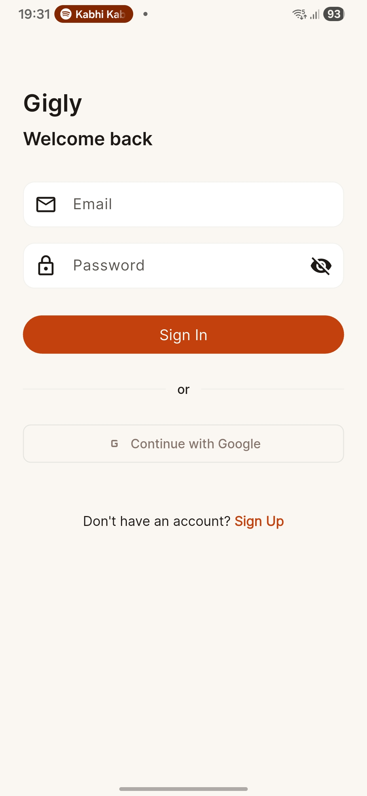
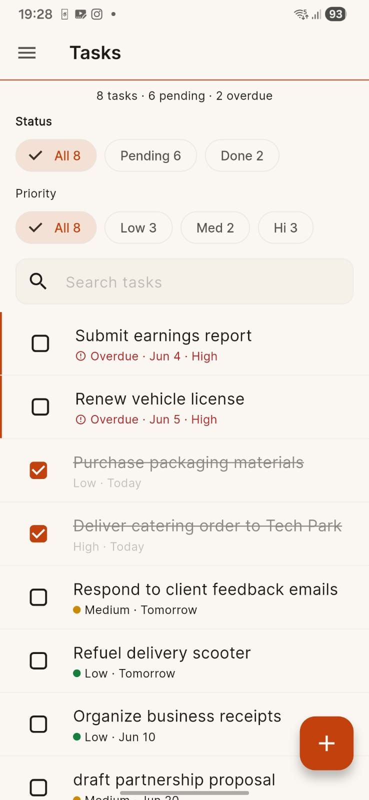
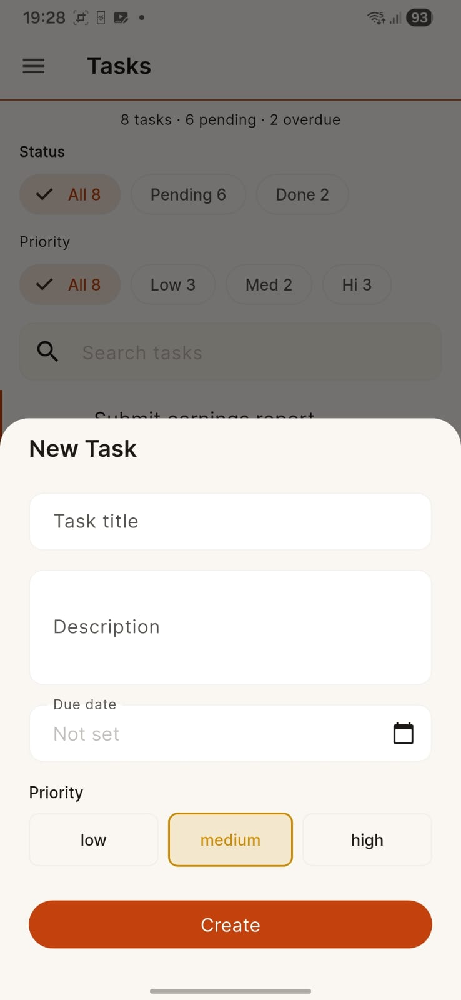
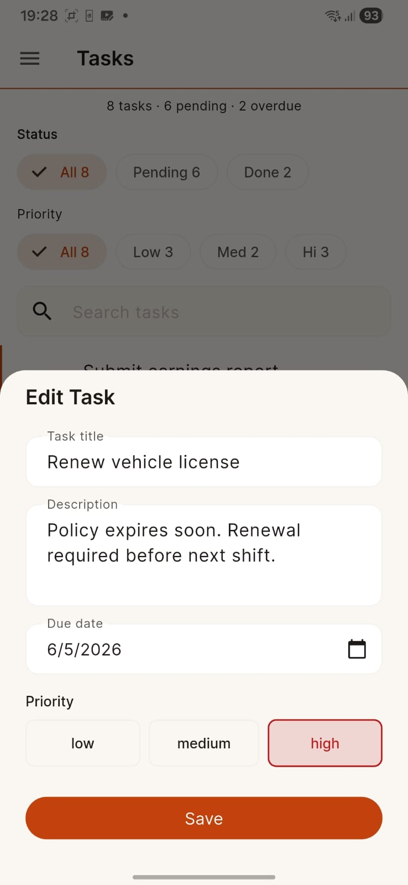
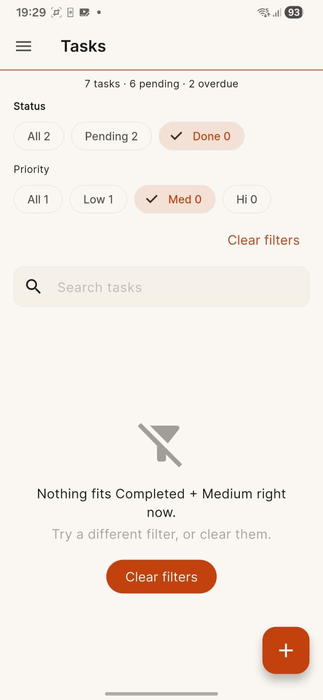
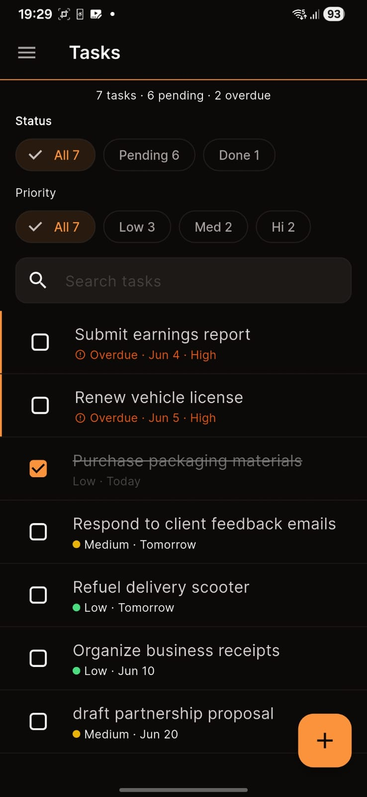
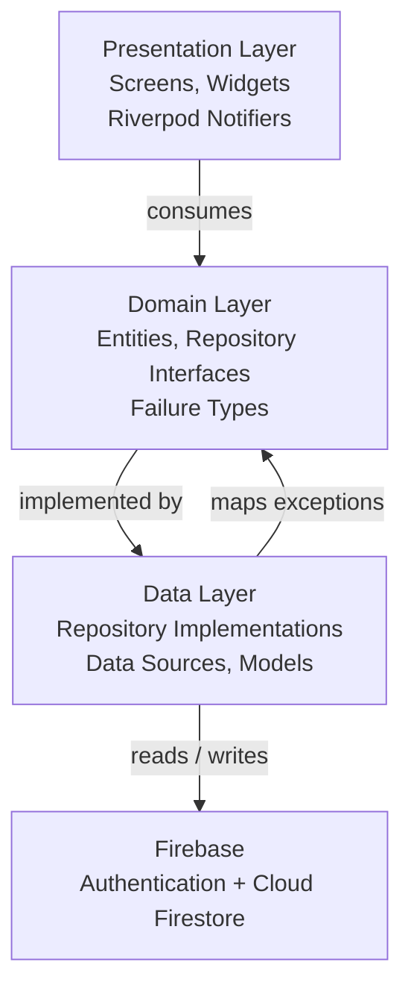

# Gigly

A Flutter task management application for gig workers built with Clean Architecture, Riverpod, Firebase Authentication, and Cloud Firestore. The app provides a focused, real-time task experience with authentication, filtering, search, and dark mode support using Material 3 and a custom Warm Ink design palette.


---

## Demo

### Demo Video

[](https://youtube.com/shorts/HuV2GTPsS1Y)

The video walks through the full user flow: registration, login, task creation, editing, completion, search, filtering by status and priority, and dark mode toggle.

### Technical Documentation

[Gigly Technical Documentation](https://docs.google.com/document/d/17MwWCUeiu8m-KiLdtPZobgxHUn3w-_9w1Uf7eGc_2aQ/edit?usp=sharing)

The documentation covers the architectural decisions, data flow diagrams, Firestore schema design, route design, and testing strategy in detail.

---

## Quick Highlights

- Clean Architecture (data/domain/presentation per feature)
- Riverpod state management with lazy initialization and override-based testing
- Firebase Authentication (email/password + Google Sign-In)
- Cloud Firestore with real-time stream synchronization
- Firestore offline persistence for connectivity resilience
- Sealed error hierarchies (`AuthFailure`, `TaskFailure`) with exhaustive pattern matching
- Undo delete with document identity preservation
- Custom Warm Ink Material 3 design palette (light + dark)
- Gesture-based interaction model (tap to edit, swipe to delete)
- 52 automated tests with mocktail and ProviderContainer
- `flutter analyze` clean with zero warnings

---

## Project Showcase

### Authentication

Email and password registration and login with Firebase Authentication, plus Google Sign-In. Errors are mapped to typed failure classes (`AuthFailure` sealed hierarchy) and displayed as SnackBars.

### Task Management

Full CRUD with real-time Firestore synchronization. Tasks have a title, optional description, due date, priority level (Low, Medium, High), and completion status. Undo delete is supported via a SnackBar action that restores the original document identity.

### Filtering

Status and priority filters operate in parallel. Filter counts are cross-computed — the Status row reflects the active priority selection, and the Priority row reflects the active status selection. A search bar filters by title (case-insensitive). A combined "Clear filters" button resets all filters and search simultaneously.

### Task Dashboard

A summary line below the app bar shows "N tasks · M pending · K overdue" (the overdue clause appears only when overdue tasks exist). Counts always reflect the unfiltered task set.

### Dark Mode

A session-scoped toggle in the drawer switches between light and dark themes. The custom Warm Ink palette adapts both modes with proper contrast ratios on all surfaces. The default is system theme on restart.

### Responsive Design

The application handles keyboard insets and common screen sizes responsively. The task bottom sheet uses `ConstrainedBox` with `SingleChildScrollView` to prevent overflow.

---

## Screenshots
| Login | Dashboard |
|--------|--------|
|  |  |

| Create Task | Edit Task |
|--------|--------|
|  |  |

| Filtering | Dark Mode |
|--------|--------|
|  |  |
---

## Features

### Authentication

- Email and password registration and login
- Google Sign-In
- Form validation with inline error messages
- Firebase Authentication integration
- Typed error hierarchy with user-facing messages
- Session-scoped auth state with GoRouter redirect guards

### Task Management

- Create, read, update, and delete tasks
- Set title, description, due date, and priority
- Toggle completion status
- Undo delete with document identity preservation
- Real-time Firestore synchronization

### Productivity

- Search by title (case-insensitive)
- Filter by status (All / Pending / Completed)
- Filter by priority (All / Low / Medium / High)
- Cross-computed filter counts for contextual awareness
- Summary statistics (total, pending, overdue)
- Completion animations (130ms opacity fade)

### User Experience

- Material 3 with custom Warm Ink palette
- Light and dark mode
- Responsive layout with keyboard and landscape safety
- Gesture-based interaction (tap to edit, swipe to delete)
- Editorial card-free task rows with priority indicators
- Overdue tasks highlighted with error color and 2px left indicator
- Three contextual empty states (first run, no results, filtered empty)

### Technical Features

- Clean Architecture with feature-first folder structure
- Repository pattern separating data sources from domain logic
- Riverpod for reactive state management
- Firestore real-time streams with typed mapping
- Sealed failure hierarchies (`AuthFailure`, `TaskFailure`)
- 52 unit tests with mocktail
- `flutter analyze` clean with zero warnings
- Undo delete cache in the notifier layer
- Google Sign-In with popup cancellation handling

---

## Architecture

The application follows Clean Architecture with three layers per feature. Dependencies point inward: Presentation depends on Domain, Domain depends on Data, and Data depends on Firebase.



Each feature (auth, tasks, dashboard) is self-contained within `lib/features/<feature>/` with its own data, domain, and presentation subdirectories. Shared utilities live in `lib/core/`.

---

## Folder Structure

```
lib/
├── main.dart                                         # App entry point, Firebase init, theme wiring
├── firebase_options.dart                             # Firebase project configuration
├── core/
│   ├── constants/constants.dart
│   ├── di/di.dart
│   ├── errors/errors.dart                            # AuthFailure, TaskFailure sealed hierarchies
│   ├── network/network.dart
│   ├── router/router.dart                            # GoRouter with auth redirect guards
│   ├── theme/
│   │   ├── app_theme.dart                            # Custom Warm Ink palette (light + dark)
│   │   ├── theme.dart
│   │   └── theme_provider.dart                       # ThemeModeNotifier
│   ├── utils/utils.dart
│   └── widgets/
│       ├── gigly_bottom_sheet.dart
│       ├── gigly_dialog.dart
│       ├── gigly_drawer.dart
│       ├── gigly_loading_spinner.dart
│       └── gigly_snackbar.dart
└── features/
    ├── auth/
    │   ├── data/
    │   │   ├── datasources/datasources.dart          # FirebaseAuth + GoogleSignIn
    │   │   ├── datasources/auth_exception.dart        # AuthException mapping
    │   │   ├── models/models.dart
    │   │   └── repositories/repositories.dart
    │   ├── domain/
    │   │   ├── entities/entities.dart
    │   │   ├── repositories/repositories.dart
    │   │   └── usecases/usecases.dart
    │   └── presentation/
    │       ├── pages/
    │       │   ├── login_screen.dart
    │       │   ├── register_screen.dart
    │       │   ├── splash_screen.dart
    │       │   └── pages.dart
    │       ├── providers/providers.dart               # AuthNotifier with Google Sign-In
    │       └── widgets/widgets.dart
    ├── dashboard/
    │   ├── data/
    │   │   ├── datasources/datasources.dart
    │   │   ├── models/models.dart
    │   │   └── repositories/repositories.dart
    │   ├── domain/
    │   │   ├── entities/entities.dart
    │   │   ├── repositories/repositories.dart
    │   │   └── usecases/usecases.dart
    │   └── presentation/
    │       ├── pages/pages.dart
    │       └── providers/providers.dart
    └── tasks/
        ├── data/
        │   ├── datasources/datasources.dart           # Firestore CRUD + real-time streams
│   ├── datasources/task_exception.dart
│   ├── models/models.dart
        │   └── repositories/repositories.dart
        ├── domain/
        │   ├── entities/entities.dart                # TaskEntity, TaskPriority enum
        │   ├── repositories/repositories.dart
        │   └── usecases/usecases.dart
        └── presentation/
            ├── pages/
            │   ├── add_edit_task_bottom_sheet.dart
            │   ├── home_screen.dart
            │   └── pages.dart
            ├── providers/providers.dart               # Stream providers, filters, search, actions
            └── widgets/widgets.dart
test/
└── features/
    ├── auth/data/repositories/auth_repository_impl_test.dart
    └── tasks/
        ├── data/repositories/tasks_repository_impl_test.dart
        └── presentation/providers/
            ├── providers_test.dart
            ├── filtered_tasks_provider_test.dart
            ├── task_actions_notifier_test.dart
            └── filter_counts_provider_test.dart
```

---

## State Management

Riverpod provides compile-time safety, lazy initialization, and override-based testing without requiring `BuildContext` to read state.

The data flow is layered. `FirestoreTaskRemoteDataSource` exposes a real-time stream of `TaskModel` snapshots. `TasksRepositoryImpl` maps those to domain `TaskEntity` objects and wraps Firestore errors into sealed `TaskFailure` types. The `tasksStreamProvider` watches `authStateProvider` — it returns an empty stream when the user is null and re-creates the Firestore listener on auth changes, eliminating manual cleanup.

`filteredTasksProvider` combines the stream, `taskFilterProvider`, and `taskSearchProvider` into a single derived computation. `filterCountsProvider` extends this pattern with cross-filtered counts (status counts reflect the active priority filter; priority counts reflect the active status filter). `TaskActionsNotifier` handles mutations with loading/data/error states that widgets watch via `ref.listen`, keeping the UI layer declarative.

---

## Firebase Integration

`FirebaseAuthRemoteDataSource` wraps Firebase sign-in methods and maps all `FirebaseAuthException` codes into typed `AuthFailure` subclasses. Google Sign-In uses `google_sign_in` 7.x with popup cancellation handled silently. The `authStateProvider` exposes `authStateChanges()` as a Riverpod stream that the GoRouter watches for redirect guards.

`FirestoreTaskRemoteDataSource` uses a typed `CollectionReference<TaskModel>` for compile-safe reads and writes. Queries are ordered by `dueDate` ascending; null due dates are represented as `DateTime(2100, 1, 1)` to maintain a deterministic sort order while preserving the semantics of an unset date. Each document stores the owner's `uid` for security rule enforcement. The repository generates UUIDs and timestamps — the data source only delegates serialized writes.

The `getTasks()` method returns `Stream<List<TaskEntity>>` backed by `FirebaseFirestore.snapshots()`. Firestore offline persistence is enabled at app startup to maintain state during brief connectivity loss.

---

## Security

- All Firestore documents are scoped to the authenticated user's `uid`.
- The repository never exposes Firebase internals to the UI layer; all errors are mapped to `TaskFailure` sealed types before reaching widgets.
- Google Sign-In popup cancellation is handled with an empty-message failure that does not display an error UI.
- The router enforces auth state: unauthenticated users are redirected to the login screen, authenticated users are redirected away from it.

---

## Engineering Highlights

### Clean Architecture

Each feature is organized into `data/`, `domain/`, and `presentation/` layers. The domain layer contains entity definitions and repository interfaces with zero framework dependencies. The data layer implements those interfaces and maps external types to domain types. The presentation layer consumes domain types through Riverpod providers and never imports Firebase or Firestore types directly.

### Repository Pattern

The repository is the architectural boundary: exceptions are caught in the data layer, mapped to domain failures, and rethrown as sealed types. This means a `TaskFailure` switch in widget code covers every failure mode without catching raw `FirebaseException`.

### Error Handling

Both `AuthFailure` and `TaskFailure` are `sealed class` hierarchies that implement `Exception`. This makes them compatible with Riverpod's `AsyncError` (which stores `Object`) while maintaining exhaustive pattern matching with `switch`.

### Riverpod

The provider layer separates concerns: a stream provider for raw data, filter/search providers for user intent, derived providers for combined views, and a notifier for mutations. The `filterCountsProvider` is an example of derived state — it watches both the stream and the filter to compute cross-filtered counts without redundant state.

### Firebase Integration

Datasources are injectable (defaulting to `FirebaseAuth.instance` / `FirebaseFirestore.instance` but accepting overrides for testing). Typed collections with `withConverter` prevent runtime type errors.

### Testing Strategy

The test suite covers repositories (auth + tasks), filter state, search state, combined filtered provider behavior, task action notifier lifecycles (create, update, toggle, delete, undo), and the new filter counts provider. All tests use `mocktail` for repository mocking and `ProviderContainer` for Riverpod integration without widget mounting. The suite validates success paths, failure paths with the sealed error hierarchy, edge cases (empty lists, null filters, cache state), and state transitions (loading → data, loading → error).

---

## Assignment Coverage

| Requirement | Implementation |
|---|---|
| User Registration | `register_screen.dart` + `AuthRepositoryImpl.register()` |
| User Login | `login_screen.dart` + `AuthRepositoryImpl.login()` |
| Firebase Authentication | `FirebaseAuthRemoteDataSource` wrapping `FirebaseAuth` |
| Task Creation | `AddEditTaskBottomSheet` + `TaskActionsNotifier.createTask()` |
| Task Editing | `AddEditTaskBottomSheet` + `TaskActionsNotifier.updateTask()` |
| Task Deletion | `Dismissible` swipe-to-delete + `TaskActionsNotifier.deleteTask()` |
| Task Viewing | `HomeScreen` with `filteredTasksProvider` + `ListView.builder` |
| Task Completion Toggle | `Checkbox` + `TaskActionsNotifier.toggleCompletion()` |
| Due Dates | `TaskEntity.dueDate` + date picker in bottom sheet |
| Priority Levels | `TaskPriority` enum with color-coded indicators in task rows and bottom sheet |
| Real-time Firestore Sync | `FirestoreTaskRemoteDataSource` returning `Stream<List<TaskModel>>` |
| Task Search | `taskSearchProvider` with case-insensitive title matching |
| Filter by Status | `taskFilterProvider.showCompleted` with chips in filter section |
| Filter by Priority | `taskFilterProvider.priority` with chips in filter section |
| Task Dashboard Overview | `taskStatsProvider` + `_SummaryLine` widget |
| Dark Mode | `ThemeModeNotifier` with custom Warm Ink dark palette |
| Responsive UI | `ConstrainedBox` + `SingleChildScrollView` + `MediaQuery` bottom inset |
| Material 3 Design | Full `ColorScheme`-based theme with `useMaterial3: true` |

---

## Getting Started

### Prerequisites

- Flutter SDK ^3.29
- Dart ^3.11
- A Firebase project with Authentication (Email/Password + Google) and Cloud Firestore enabled

### Setup

1.  Clone the repository:

    ```bash
    git clone https://github.com/PrithviKaushik/gigly
    cd gigly
    ```

2.  Install dependencies:

    ```bash
    flutter pub get
    ```

3.  Create a Firebase project at the [Firebase Console](https://console.firebase.google.com).

4.  Enable Email/Password and Google Sign-In under Authentication → Sign-in method.

5.  Create a Cloud Firestore database in test mode.

6.  Configure Firebase for the project:

    ```bash
    flutterfire configure --project=<your-firebase-project-id>
    ```

    This generates `lib/firebase_options.dart` with the platform-specific configuration.

7.  Run the application:

    ```bash
    flutter run
    ```

### Google Sign-In (Android)

Add your debug SHA-1 fingerprint in the Firebase Console under Project Settings → General → Your apps → Android. Run `cd android && ./gradlew signingReport` to find your debug SHA-1.

---

## Running Tests

```bash
flutter analyze
flutter test
```

- `flutter analyze` reports zero warnings with the `flutter_lints` rule set.
- `flutter test` runs 52 automated tests covering repositories, providers, filtering logic, notifier lifecycles, error handling, and state transitions.

---

## Demo Walkthrough

| Step | Action | Expected Result |
|---|---|---|
| 1 | Launch the app | Splash screen appears briefly, then navigates to login |
| 2 | Tap "Register" and create an account | Account created; navigated to Home |
| 3 | Tap the FAB (+) to create a task | Bottom sheet opens; fill title, set priority, pick date |
| 4 | Tap "Create" | Task appears in the list |
| 5 | Tap the task row | Edit bottom sheet opens; modify and save |
| 6 | Tap the checkbox | Task is toggled completed; opacity reduces, strikethrough appears |
| 7 | Type in the search bar | List filters by matching titles |
| 8 | Tap status or priority chips | List updates; chip counts reflect cross-filtered totals |
| 9 | Open the drawer and toggle Dark Mode | App switches to dark palette |
| 10 | Tap Logout | Returns to login screen |

---

## Challenges & Learnings

Feature-first Clean Architecture was chosen over layer-first to keep each feature self-contained. The trade-off is some duplication of core patterns (repository interfaces, failure types), but the benefit is that a new contributor can read one feature directory and understand the full stack without cross-referencing multiple layer directories.

The sentinel date pattern (`DateTime(2100, 1, 1)` for null due dates) solved Firestore's lack of null-aware `orderBy`. Filtering null-due-date tasks client-side and appending them would have broken pagination and stream consistency. Using a sentinel that sorts after any real date keeps null-due-date tasks at the bottom of the list while allowing a single Firestore query. Mapping `FirebaseAuthException` codes to a sealed failure hierarchy is more verbose than a catch-all rethrow, but the UI layer benefits from exhaustive `switch` coverage without string-matching error codes.

Riverpod's provider composition made the filter system straightforward: separate providers for the stream, filters, and search combine into a pure derived computation that recomputes only when a dependency changes. Ensuring the stream provider resets on logout required watching `authStateProvider` and returning `Stream.empty()` when the user is null, preventing stale listeners after sign-out.

Mocking Firestore directly is fragile — `withConverter` typing and snapshot listener patterns are hard to stub. The repository pattern solved this by isolating the data source behind an interface: tests mock the repository, never Firestore. `ProviderContainer` from Riverpod allowed testing the full provider chain without widget mounting, keeping tests under 2 seconds for 52 tests.

The card-free task row was a deliberate trade-off: removing `Card` wrappers loses hierarchical visual separation, but the result is a denser, more editorial list. The two-interaction model (tap to edit, swipe to delete) removed the kebab menu at the cost of losing a dedicated delete affordance for non-swipe users — the undo SnackBar makes deletion recoverable. The chip-based filters were chosen over dropdowns because both filter dimensions stay visible, and cross-computed counts tell the user what each chip will do before they tap it.

---

## Future Improvements

- **Push Notifications** — Integrate Firebase Cloud Messaging for due-date reminders and task assignments.
- **Enhanced offline-first architecture** — Improve local caching and conflict resolution beyond Firestore's built-in offline persistence.
- **Recurring Tasks** — Add a recurrence model (daily, weekly, monthly) with automatic next-instance generation on completion.
- **Calendar Integration** — Add a calendar view for due-date visualization, backed by the existing Firestore collection.
- **Advanced Analytics** — Track completion rates, average completion time, and productivity trends using Firestore aggregate queries.

---

## Evaluation Notes

This project was developed as part of a Flutter internship assessment. The focus was on maintainability, scalability, and user experience:

- **Maintainability** — Clean Architecture with feature-first organization, sealed failure hierarchies, and injectable data sources.
- **Scalability** — Riverpod's lazy provider initialization and reactive composition ensure that adding new features does not require refactoring existing state management.
- **User Experience** — The interaction model reduces cognitive load (two gestures per task), the filter system provides awareness through cross-counts, and the Warm Ink palette differentiates the product visually.
- **Testing** — 52 tests cover repository error mapping, provider state transitions, notifier lifecycle, and combined filter behavior. All tests run under 2 seconds and verify both success and failure paths.
- **Engineering Practices** — `flutter analyze` passes with zero warnings, no lint suppressions, no type casts, and no runtime null-safety violations.
